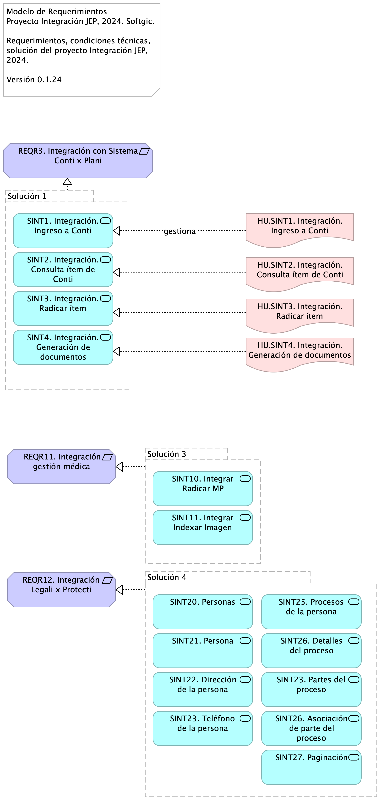

# Requerimientos de Integración JEP

* [Introducción](#Introducción)
* [Solución 1 (Grouping)](#solución-1-grouping)
  * [SINT1. Integración. Ingreso a Conti (Application Service)](#sint1.-integración.-ingreso-a-conti-application-service)
  * [SINT2. Integración. Consulta ítem de Conti (Application Service)](#sint2.-integración.-consulta-ítem-de-conti-application-service)
  * [SINT3. Integración. Radicar ítem (Application Service)](#sint3.-integración.-radicar-ítem-application-service)
  * [SINT4. Integración. Generación de documentos (Application Service)](#sint4.-integración.-generación-de-documentos-application-service)
* [REQR3. Integración con Sistema Conti x Plani (Requirement)](#reqr3.-integración-con-sistema-conti-x-plani-requirement)
* [Solución 3 (Grouping)](#solución-3-grouping)
  * [SINT10. Integrar Radicar MP (Application Service)](#sint10.-integrar-radicar-mp-application-service)
  * [SINT11. Integrar Indexar Imagen (Application Service)](#sint11.-integrar-indexar-imagen-application-service)
* [ REQR11. Integración gestión médica (Requirement)](#-reqr11.-integración-gestión-médica-requirement)
* [Solución 4 (Grouping)](#solución-4-grouping)
  * [SINT20. Personas (Application Service)](#sint20.-personas-application-service)
  * [SINT21. Persona (Application Service)](#sint21.-persona-application-service)
  * [SINT22. Dirección de la persona (Application Service)](#sint22.-dirección-de-la-persona-application-service)
  * [SINT23. Teléfono de la persona (Application Service)](#sint23.-teléfono-de-la-persona-application-service)
  * [SINT25. Procesos de la persona (Application Service)](#sint25.-procesos-de-la-persona-application-service)
  * [SINT26. Detalles del proceso (Application Service)](#sint26.-detalles-del-proceso-application-service)
  * [SINT23. Partes del proceso (Application Service)](#sint23.-partes-del-proceso-application-service)
  * [SINT26. Asociación de parte del proceso (Application Service)](#sint26.-asociación-de-parte-del-proceso-application-service)
  * [SINT27. Paginación (Application Service)](#sint27.-paginación-application-service)
* [REQR12. Integración Legali x Protecti (Requirement)](#reqr12.-integración-legali-x-protecti-requirement)
* [HU.SINT1. Integración. Ingreso a Conti (Deliverable)](#hu.sint1.-integración.-ingreso-a-conti-deliverable)
* [HU.SINT2. Integración. Consulta ítem de Conti (Deliverable)](#hu.sint2.-integración.-consulta-ítem-de-conti-deliverable)
* [HU.SINT3. Integración. Radicar ítem (Deliverable)](#hu.sint3.-integración.-radicar-ítem-deliverable)
* [HU.SINT4. Integración. Generación de documentos (Deliverable)](#hu.sint4.-integración.-generación-de-documentos-deliverable)

## Introducción

{height=500px}

Para la implementación de los ítems relacionados en el Anexo Nro. 1.1 – Anexo técnico evolución plataforma de interoperabilidad – Ficha Técnica la hoja “Categorías de Cotización” contiene las necesidades a contratar en el ámbito de la evolución tecnológica del modelo de interoperabilidad y los desarrollos de interoperabilidad tanto con sistemas internos, como con entidades externas. En la hoja “Estándares Desarrollo y Producto” del archivo mencionado se indican los estándares recomendados por el fabricante, para tener en cuenta en la entrega de los servicios que se cotizan.

El Anexo Nro. 1.2 – Acuerdos de Niveles de Servicio, explica el procedimiento con el que se dará atención a consultas o solución de incidencias, tanto en los sistemas operativos, como en los servicios de interoperabilidad existentes en la actualidad y aquellos que se contratarán en este proceso, en el sistema Bus de Interoperabilidad implementado en la Jurisdicción Especial para la Paz.

Fuente: Justificativo de la Contratación Invitación Pública.

## Solución 1

### SINT1. Integración. Ingreso a Conti

Tareas de desarrollo

* Interoperabilidad IOP1. Transporte / Entrega Consulta Negocio 	
* Modelo de datos (XML, RBDMS, …)
* Esquema de datos (XSD, DTD, JSON-E…)
* Contratos de interoperabilidad (WSDL, API…)
* Mensajes petición IN (API, XML…)
* Mensajes respuesta OUT (API, XML…)
* Mensajes excepción (API, XML…)
* Transporte (REST, SOAP)
* Función lógica (JEE, …)
* Registro y envío de actividad

### SINT2. Integración. Consulta ítem de Conti

Tareas de desarrollo

* Interoperabilidad IOP1. Transporte / Entrega Consulta Negocio 	
* Modelo de datos (XML, RBDMS, …)
* Esquema de datos (XSD, DTD, JSON-E…)
* Contratos de interoperabilidad (WSDL, API…)
* Mensajes petición IN (API, XML…)
* Mensajes respuesta OUT (API, XML…)
* Mensajes excepción (API, XML…)
* Transporte (REST, SOAP)
* Función lógica (JEE, …)
* Registro y envío de actividad

### SINT3. Integración. Radicar ítem

Tareas de desarrollo

* Interoperabilidad IOP1. Transporte / Entrega Consulta Negocio 	
* Modelo de datos (XML, RBDMS, …)
* Esquema de datos (XSD, DTD, JSON-E…)
* Contratos de interoperabilidad (WSDL, API…)
* Mensajes petición IN (API, XML…)
* Mensajes respuesta OUT (API, XML…)
* Mensajes excepción (API, XML…)
* Transporte (REST, SOAP)
* Función lógica (JEE, …)
* Registro y envío de actividad

### SINT4. Integración. Generación de documentos

Tareas de desarrollo

* Interoperabilidad IOP1. Transporte / Entrega Consulta Negocio 	
* Modelo de datos (XML, RBDMS, …)
* Esquema de datos (XSD, DTD, JSON-E…)
* Contratos de interoperabilidad (WSDL, API…)
* Mensajes petición IN (API, XML…)
* Mensajes respuesta OUT (API, XML…)
* Mensajes excepción (API, XML…)
* Transporte (REST, SOAP)
* Función lógica (JEE, …)
* Registro y envío de actividad

## REQR3. Integración con Sistema Conti x Plani

Atendiendo la necesidad de la Subdirección de Contratación de implementar el flujo de gestión precontractual en el sistema de Gestión Documental - Conti se requiere contar con la información de los ítems del Plan Anual de Adquisiciones – PAA para iniciar el proceso, la cual se encuentra gestionada en el Sistema de Gestión y Planeación Institucional PLANi.

Los casos de uso asociados al requerimiento se listan más adelante.

## Solución 3

### SINT10. Integrar Radicar MP

Tareas de desarrollo

* Interoperabilidad IOP1. Transporte / Entrega Consulta Negocio 	
* Modelo de datos (XML, RBDMS, …)
* Esquema de datos (XSD, DTD, JSON-E…)
* Contratos de interoperabilidad (WSDL, API…)
* Mensajes petición IN (API, XML…)
* Mensajes respuesta OUT (API, XML…)
* Mensajes excepción (API, XML…)
* Transporte (REST, SOAP)
* Función lógica (JEE, …)
* Registro y envío de actividad

### SINT11. Integrar Indexar Imagen

Tareas de desarrollo

* Interoperabilidad IOP1. Transporte / Entrega Consulta Negocio 	
* Modelo de datos (XML, RBDMS, …)
* Esquema de datos (XSD, DTD, JSON-E…)
* Contratos de interoperabilidad (WSDL, API…)
* Mensajes petición IN (API, XML…)
* Mensajes respuesta OUT (API, XML…)
* Mensajes excepción (API, XML…)
* Transporte (REST, SOAP)
* Función lógica (JEE, …)
* Registro y envío de actividad

##  REQR11. Integración gestión médica

Documentación de la gestión médica JEP. 

Fuente: gestionMedidaProteccion (pdf). 

### Índice de la documentación (casos de uso)

1. Caso de Uso 1. Integrar Radicar MP
1. Caso de Uso 2. Integrar Indexar Imagen

## Solución 4

### SINT20. Personas

Tareas de desarrollo

* Interoperabilidad IOP1. Transporte / Entrega Consulta Negocio 	
* Modelo de datos (XML, RBDMS, …)
* Esquema de datos (XSD, DTD, JSON-E…)
* Contratos de interoperabilidad (WSDL, API…)
* Mensajes petición IN (API, XML…)
* Mensajes respuesta OUT (API, XML…)
* Mensajes excepción (API, XML…)
* Transporte (REST, SOAP)
* Función lógica (JEE, …)
* Registro y envío de actividad

### SINT21. Persona

Tareas de desarrollo

* Interoperabilidad IOP1. Transporte / Entrega Consulta Negocio 	
* Modelo de datos (XML, RBDMS, …)
* Esquema de datos (XSD, DTD, JSON-E…)
* Contratos de interoperabilidad (WSDL, API…)
* Mensajes petición IN (API, XML…)
* Mensajes respuesta OUT (API, XML…)
* Mensajes excepción (API, XML…)
* Transporte (REST, SOAP)
* Función lógica (JEE, …)
* Registro y envío de actividad

### SINT22. Dirección de la persona

Tareas de desarrollo

* Interoperabilidad IOP1. Transporte / Entrega Consulta Negocio 	
* Modelo de datos (XML, RBDMS, …)
* Esquema de datos (XSD, DTD, JSON-E…)
* Contratos de interoperabilidad (WSDL, API…)
* Mensajes petición IN (API, XML…)
* Mensajes respuesta OUT (API, XML…)
* Mensajes excepción (API, XML…)
* Transporte (REST, SOAP)
* Función lógica (JEE, …)
* Registro y envío de actividad

### SINT23. Teléfono de la persona

Tareas de desarrollo

* Interoperabilidad IOP1. Transporte / Entrega Consulta Negocio 	
* Modelo de datos (XML, RBDMS, …)
* Esquema de datos (XSD, DTD, JSON-E…)
* Contratos de interoperabilidad (WSDL, API…)
* Mensajes petición IN (API, XML…)
* Mensajes respuesta OUT (API, XML…)
* Mensajes excepción (API, XML…)
* Transporte (REST, SOAP)
* Función lógica (JEE, …)
* Registro y envío de actividad

### SINT25. Procesos de la persona

Tareas de desarrollo

* Interoperabilidad IOP1. Transporte / Entrega Consulta Negocio 	
* Modelo de datos (XML, RBDMS, …)
* Esquema de datos (XSD, DTD, JSON-E…)
* Contratos de interoperabilidad (WSDL, API…)
* Mensajes petición IN (API, XML…)
* Mensajes respuesta OUT (API, XML…)
* Mensajes excepción (API, XML…)
* Transporte (REST, SOAP)
* Función lógica (JEE, …)
* Registro y envío de actividad

### SINT26. Detalles del proceso

Tareas de desarrollo

* Interoperabilidad IOP1. Transporte / Entrega Consulta Negocio 	
* Modelo de datos (XML, RBDMS, …)
* Esquema de datos (XSD, DTD, JSON-E…)
* Contratos de interoperabilidad (WSDL, API…)
* Mensajes petición IN (API, XML…)
* Mensajes respuesta OUT (API, XML…)
* Mensajes excepción (API, XML…)
* Transporte (REST, SOAP)
* Función lógica (JEE, …)
* Registro y envío de actividad

### SINT23. Partes del proceso

Tareas de desarrollo

* Interoperabilidad IOP1. Transporte / Entrega Consulta Negocio 	
* Modelo de datos (XML, RBDMS, …)
* Esquema de datos (XSD, DTD, JSON-E…)
* Contratos de interoperabilidad (WSDL, API…)
* Mensajes petición IN (API, XML…)
* Mensajes respuesta OUT (API, XML…)
* Mensajes excepción (API, XML…)
* Transporte (REST, SOAP)
* Función lógica (JEE, …)
* Registro y envío de actividad

### SINT26. Asociación de parte del proceso

Tareas de desarrollo

* Interoperabilidad IOP1. Transporte / Entrega Consulta Negocio 	
* Modelo de datos (XML, RBDMS, …)
* Esquema de datos (XSD, DTD, JSON-E…)
* Contratos de interoperabilidad (WSDL, API…)
* Mensajes petición IN (API, XML…)
* Mensajes respuesta OUT (API, XML…)
* Mensajes excepción (API, XML…)
* Transporte (REST, SOAP)
* Función lógica (JEE, …)
* Registro y envío de actividad

### SINT27. Paginación

Tareas de desarrollo

* Interoperabilidad IOP1. Transporte / Entrega Consulta Negocio 	
* Modelo de datos (XML, RBDMS, …)
* Esquema de datos (XSD, DTD, JSON-E…)
* Contratos de interoperabilidad (WSDL, API…)
* Mensajes petición IN (API, XML…)
* Mensajes respuesta OUT (API, XML…)
* Mensajes excepción (API, XML…)
* Transporte (REST, SOAP)
* Función lógica (JEE, …)
* Registro y envío de actividad

## REQR12. Integración Legali x Protecti

Documentación API de integración. Creación de documento técnico para el consumo de servicios web.

Fuente: Documentación técnica - API Integración - Consulta de personas (pdf). Pedro Escobar, ing.

### Índice de la documentación (casos de uso)

1. Personas
1. Persona
1. Dirección de la persona
1. Teléfono de la persona
1. Procesos de la persona
1. Detalles del proceso
1. Partes del proceso
1. Asociación de parte del proceso
1. Paginación

[^1]: Generated: Thu Nov 07 2024 18:55:39 GMT-0500 (COT)
