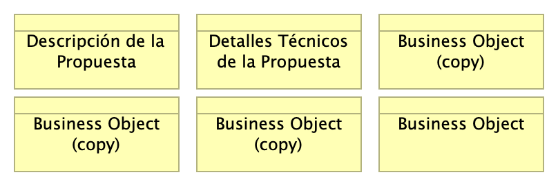

# Contenido
* [Información del Documento](#información-del-documento)
* [Sección 1](#sección-1)
* [Anexos](#anexos)

\newpage

# Información del Documento

## Versión del Documento

> 

 

---
title: Propuesta de Certificación Operativa Plataforma de Software Trii.co (borrador)
subtitle: Borrador
subject: Implementación Proyecto
author: ${DEVDOCS_AUTOR}
date: 2025-01-15
keywords: [Rendimiento, Métodos pruebas, Pruebas software, QA]
header-right: 
geometry:
  - top=1.3in
  - bottom=1in
fignos-cleveref: True
fignos-plus-name: Fig.
fignos-caption-name: Imagen
tablenos-caption-name: Tabla
...

## Control de Cambios
Historia de cambios de la propuesta.

Versión actual: 
1.$COMMIT

Versiones Anteriores

$VERSIONES

### Realizado Por
H. Wong, ing.

### Revisado Por
(revisor), Trii.co

---
lang: en
titlepage: true
titlepage-rule-color: 360049
...

\newpage

# Sección 1

## 02.propuesta

> 

 

---
title: Propuesta de Certificación Operativa Plataforma de Software Trii.co (borrador)
subtitle: Borrador
subject: Implementación Proyecto
author: ${DEVDOCS_AUTOR}
date: 2025-01-15
keywords: [Rendimiento, Métodos pruebas, Pruebas software, QA]
header-right: 
geometry:
  - top=1.3in
  - bottom=1in
fignos-cleveref: True
fignos-plus-name: Fig.
fignos-caption-name: Imagen
tablenos-caption-name: Tabla
...

{#fig:id-dd2f1c1c1816447380fe900b66faa8bc width= height=500px}

### Business Object (copy)
## Control de Cambios
Historia de cambios de la propuesta.

### Business Object (copy)
## Control de Cambios
Historia de cambios de la propuesta.

## Control de Cambios
Historia de cambios de la propuesta.

### Business Object (copy)
## Control de Cambios
Historia de cambios de la propuesta.

### Business Object (copy)
## Control de Cambios
Historia de cambios de la propuesta.

### Business Object (copy)
## Control de Cambios
Historia de cambios de la propuesta.

### Business Object
## Control de Cambios
Historia de cambios de la propuesta.

---
lang: en
titlepage: true
titlepage-rule-color: 360049
...

\newpage

# Anexos