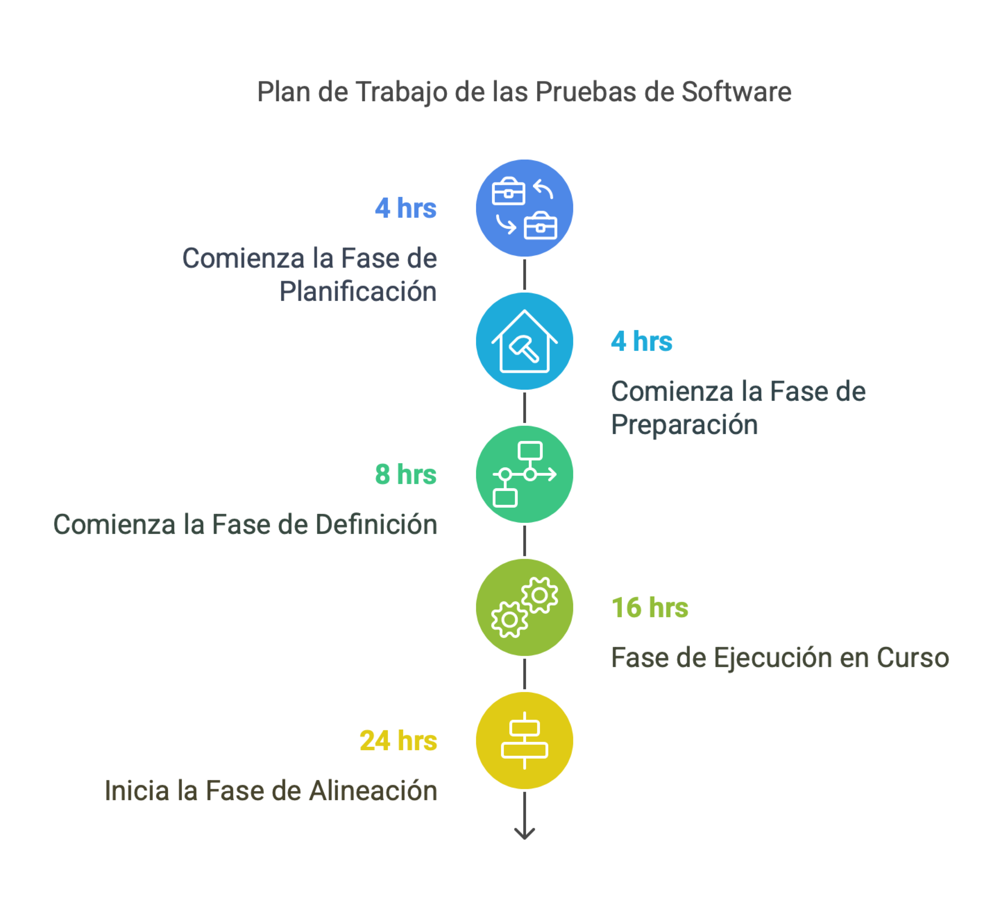

## Plan de Trabajo

1. Planificación, 4 hrs
1. Preparación, 4 hrs
1. Alistamiento, 8 hrs o menos (*)
1. Definición, 8 hrs (*)
1. Verificación, 4 hrs 
1. Ejecución, 16 hrs
1. Alineación, 8 hrs

{#fig:plan width=}

