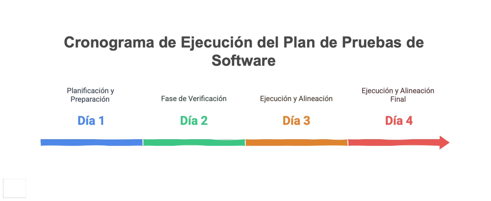

### Cronograma de Ejecución del Plan
{#fig:cronograma width=}

1er día, actividades en paralelo
- Planificación, 4 hrs
- Preparación. 4 hrs
- Alistamiento. 8 hrs o menos (*)

2do día, actividades en paralelo
- Definición. 8 hrs (*)
- Verificación. 4 hrs 

3er día, actividades en paralelo
- Ejecución. 8 hrs
- Alineación. 4 hrs

4to día, actividades en paralelo
- Ejecución. 8 hrs
- Alineación. 4 hrs

