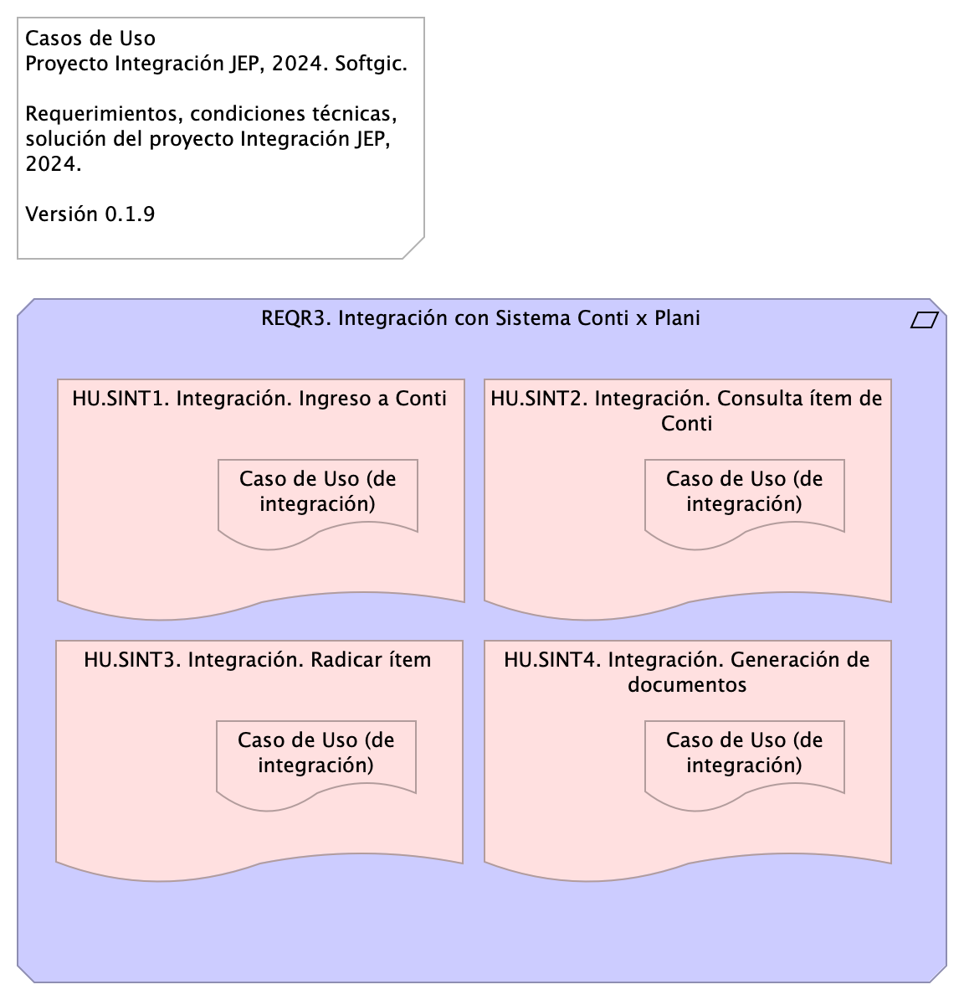
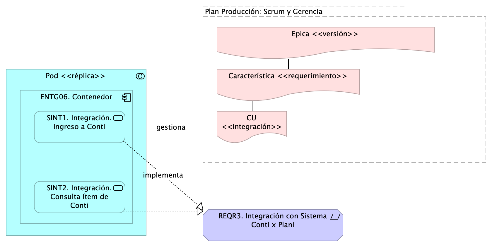

# Contenido
* [Información del Documento](#información-del-documento)
* [Especificaciones de Casos de Uso de Integración](#especificaciones-de-casos-de-uso-de-integración)
* [Anexos](#anexos)

\newpage

# Información del Documento

## Versión del Documento

> 

 

---
title: Especificación Caso de Uso de Integración
subtitle: Implementación Proyecto Evolución de Interoperabilidad JEP, Softgic
subject: Implementación Proyecto
author: ${DEVDOCS_AUTOR}
date: 2024-09-16
keywords: [Integración, Interoperabilidad, JEP, Softgic]
header-left: include/jeplogo.jpg
geometry:
  - top=1in
  - bottom=1in
fignos-cleveref: True
fignos-plus-name: Fig.
fignos-caption-name: Imagen
tablenos-caption-name: Tabla
...

Versión Actual

1.$COMMIT

Versiones Anteriores

$VERSIONES

## Realizado Por
Sofgic.co

## Revisado Por
Sofgic.co

---
lang: "en"
titlepage: true
titlepage-rule-color: "360049"
...

\newpage

# Especificaciones de Casos de Uso de Integración

## Casos de Uso del Proyecto JEP

> Casos de Uso Proyecto Integración JEP, 2024. Softgic.  Requerimientos, condiciones técnicas, solución del proyecto Integración JEP, 2024.  Versión 0.1.9  

 

---
title: Especificación de Integraciones (caso de uso)
subtitle: Implementación Proyecto Evolución de Interoperabilidad JEP, Softgic
subject: Implementación Proyecto JEP
author: ${DEVDOCS_AUTOR}
date: 2024-09-16
keywords: [Integración, Interoperabilidad, JEP, Softgic, Caso de uso]
header-left: include/jeplogo.jpg
geometry:
  - top=0.5in
  - bottom=0.5in
fignos-cleveref: True
fignos-plus-name: Fig.
fignos-caption-name: Imagen
tablenos-caption-name: Tabla
...

Documentación de los casos de uso de integración del proyecto JEP relacionados con los requerimientos. 

Fuente: Justificativo de la Contratación Invitación Pública.

{#fig:id-eb0cac3ffa954ca0aa6a48e757b4d309 width= height=500px}

### Catálogo de Elementos
**Caso de Uso (de integración)**
Solicitar autenticación a la aplicación Conti y devolver resultado de la solicitud de ingreso a la aplicación Plani.  #### Elementos Elegir y describir los elementos de la actual integración.  * [x] App consumidora (A) * [x] Mensaje * [ ] Canal * [ ] Ruteo * [ ] Traducción * [x] App proveedora (B) * [ ] Monitoreo  Aplicación consumidora A: Plani Aplicación proveedora B: Conti Mensaje: Ingreso a Conti * Tipo: SOAP | XML | JSN | YML | BASE64 * Contenido: Usuario o identidad Conti   #### Diseño Message Construct | Message Routing | Message Transformation | Messaging Endpoints | Messaging Channels | …  La aplicación consumidora y proveedora compartirán capacidades mediante el un mensaje de autenticación (Message Construct).  #### Matriz de interoperabilidad Detalle del intercambio entre sistemas de información o aplicaciones.    App Plani requiere compartir Información [I], Funcionalidad [F], Seguridad o Servicios [S] con la App Plani.  |                | Conti | Plani          | Legali | Otros | |----------------|-------|----------------|--------|-------| | Conti  (B)      | X     | Seguridad |        |       | | Plani  (A)      |       | X              |        |       | | Legali         |       |                | X      |       | | Otros Sistemas |       |                |        | X     |  Table: Matriz de interoperabilidad del CU Ingreso a Conti.   #### Pruebas Realizables Por cada caso de prueba de integración describir el resultado del intercambio entre sistemas de información o aplicaciones según la Matriz de interoperabilidad.  * PRUB1. Consumo: la aplicación consumidora Plani no recibe una respuesta a tiempo. * PRUB2. Ingreso: la aplicación proveedora Conti no provee un ingreso correcto. 
**Caso de Uso (de integración)**
Solicitar autenticación a la aplicación Conti y devolver resultado de la solicitud de ingreso a la aplicación Plani.  #### Elementos Elegir y describir los elementos de la actual integración.  * [x] App consumidora (A) * [x] Mensaje * [ ] Canal * [ ] Ruteo * [ ] Traducción * [x] App proveedora (B) * [ ] Monitoreo  Aplicación consumidora A: Plani Aplicación proveedora B: Conti Mensaje: Ingreso a Conti * Tipo: SOAP | XML | JSN |  * Contenido: Usuario o identidad Conti   #### Diseño Message Construct | Message Routing | Message Transformation | Messaging Endpoints | Messaging Channels | …  La aplicación consumidora y proveedora compartirán capacidades mediante el un mensaje de autenticación (Message Construct).  #### Matriz de interoperabilidad Detalle del intercambio entre sistemas de información o aplicaciones.    App Plani requiere compartir Información [I], Funcionalidad [F], Seguridad o Servicios [S] con la App Plani.  |                | Conti | Plani          | Legali | Otros | |----------------|-------|----------------|--------|-------| | Conti  (B)      | X     | Seguridad |        |       | | Plani  (A)      |       | X              |        |       | | Legali         |       |                | X      |       | | Otros Sistemas |       |                |        | X     |  Table: Matriz de interoperabilidad del CU Ingreso a Conti.   #### Pruebas Realizables Por cada caso de prueba de integración describir el resultado del intercambio entre sistemas de información o aplicaciones según la Matriz de interoperabilidad.  * PRUB1. Consumo: la aplicación consumidora Plani no recibe una respuesta a tiempo. * PRUB2. Ingreso: la aplicación proveedora Conti no provee un ingreso correcto. 
**Caso de Uso (de integración)**
Valida la información en el aplicación Conti y otorga el acceso del mismo.  #### Elementos Elegir y describir los elementos de la actual integración.  * [x] App consumidora (A) * [x] Mensaje * [ ] Canal * [ ] Ruteo * [ ] Traducción * [x] App proveedora (B) * [ ] Monitoreo  Aplicación consumidora A: Plani Aplicación proveedora B: Conti Mensaje: Ingreso a Conti * Tipo: SOAP | XML | JSN |  * Contenido: Usuario o identidad Conti   #### Diseño Message Construct | Message Routing | Message Transformation | Messaging Endpoints | Messaging Channels | …  La aplicación consumidora y proveedora compartirán capacidades mediante el un mensaje de autenticación (Message Construct).  #### Matriz de interoperabilidad Detalle del intercambio entre sistemas de información o aplicaciones.    App Plani requiere compartir Información [I], Funcionalidad [F], Seguridad o Servicios [S] con la App Plani.  |                | Conti | Plani          | Legali | Otros | |----------------|-------|----------------|--------|-------| | Conti  (B)      | X     | Seguridad |        |       | | Plani  (A)      |       | X              |        |       | | Legali         |       |                | X      |       | | Otros Sistemas |       |                |        | X     |  Table: Matriz de interoperabilidad del CU Ingreso a Conti.   #### Pruebas Realizables Por cada caso de prueba de integración describir el resultado del intercambio entre sistemas de información o aplicaciones según la Matriz de interoperabilidad.  * PRUB1. Consumo: la aplicación consumidora Plani no recibe una respuesta a tiempo. * PRUB2. Ingreso: la aplicación proveedora Conti no provee un ingreso correcto. 
**Caso de Uso (de integración)**
Valida la información en el aplicación Conti y otorga el acceso del mismo.  #### Elementos Elegir y describir los elementos de la actual integración.  * [x] App consumidora (A) * [x] Mensaje * [ ] Canal * [ ] Ruteo * [ ] Traducción * [x] App proveedora (B) * [ ] Monitoreo  Aplicación consumidora A: Plani Aplicación proveedora B: Conti Mensaje: Ingreso a Conti * Tipo: SOAP | XML | JSN |  * Contenido: Usuario o identidad Conti   #### Diseño Message Construct | Message Routing | Message Transformation | Messaging Endpoints | Messaging Channels | …  La aplicación consumidora y proveedora compartirán capacidades mediante el un mensaje de autenticación (Message Construct).  #### Matriz de interoperabilidad Detalle del intercambio entre sistemas de información o aplicaciones.    App Plani requiere compartir Información [I], Funcionalidad [F], Seguridad o Servicios [S] con la App Plani.  |                | Conti | Plani          | Legali | Otros | |----------------|-------|----------------|--------|-------| | Conti  (B)      | X     | Seguridad |        |       | | Plani  (A)      |       | X              |        |       | | Legali         |       |                | X      |       | | Otros Sistemas |       |                |        | X     |  Table: Matriz de interoperabilidad del CU Ingreso a Conti.   #### Pruebas Realizables Por cada caso de prueba de integración describir el resultado del intercambio entre sistemas de información o aplicaciones según la Matriz de interoperabilidad.  * PRUB1. Consumo: la aplicación consumidora Plani no recibe una respuesta a tiempo. * PRUB2. Ingreso: la aplicación proveedora Conti no provee un ingreso correcto. 
**REQR3. Integración con Sistema Conti x Plani**
Atendiendo la necesidad de la Subdirección de Contratación de implementar el flujo de gestión precontractual en el sistema de Gestión Documental - Conti se requiere contar con la información de los ítems del Plan Anual de Adquisiciones – PAA para iniciar el proceso, la cual se encuentra gestionada en el Sistema de Gestión y Planeación Institucional PLANi.  Los casos de uso asociados al requerimiento se listan más adelante. 

---
lang: "en"
titlepage: true
titlepage-rule-color: "360049"
...

\newpage

# Anexos

---
lang: "en"
titlepage: true
titlepage-rule-color: "360049"
...

## Plantilla de Casos de Uso del Proyecto JEP

{#fig:id-8115cb4314954a7cb873b534038c22aa width= height=500px}

---
title: Plantilla de Especificación de Integración (caso de uso)
subtitle: Implementación Proyecto Evolución de Interoperabilidad JEP, Softgic
subject: Implementación Proyecto
author: ${DEVDOCS_AUTOR}
date: 2024-09-16
keywords: [Integración, Interoperabilidad, JEP, Softgic]
header-left: include/jeplogo.jpg
geometry:
  - top=1in
  - bottom=1in
fignos-cleveref: True
fignos-plus-name: Fig.
fignos-caption-name: Imagen
tablenos-caption-name: Tabla
...

Documentación de los casos de uso de integración (CU en el diagrama) del proyecto JEP relacionados con las integraciones y requerimientos. 

Fuente: Justificativo de la Contratación Invitación Pública.

## Casos de Uso del Proyecto (integración)
App A requiere integrar Información [I] | Funcionalidad [F] | Servicios [S] con la App B, C, D…

### Elementos
Elegir y describir los elementos de la actual integración.

* [ ] App consumidora (A)
* [ ] Mensaje
* [ ] Canal
* [ ] Ruteo
* [ ] Traducción
* [ ] App proveedora (B)
* [ ] Monitoreo

### Diseño
Message Construct | Message Routing | Message Transformation | Messaging Endpoints | Messaging Channels | …

### Matriz de interoperabilidad
Detalle del intercambio entre sistemas de información o aplicaciones. 

Sistema A comparte información, funcionalidad o servicios con Sistema B.

|                | Conti | Plani          | Legali | Otros |
|----------------|-------|----------------|--------|-------|
| Conti          | X     | Inf, Seguridad |        |       |
| Plani          |       | X              |        |       |
| Legali         |       |                | X      |       |
| Otros Sistemas |       |                |        | X     |

### Pruebas Realizables
Describir por cada caso de prueba de integración el resultado del intercambio entre sistemas de información o aplicaciones según la Matriz de interoperabilidad.

