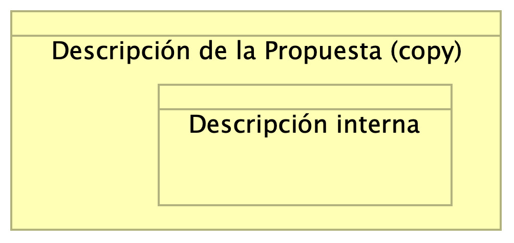

# Componentes de la Propuesta

* [Introducción](#Introducción)
* [Descripción de la Propuesta (copy) (Business Object)](#descripción-de-la-propuesta-copy-business-object)

## Introducción

{height=500px}

servicio: desarrollo, consultoría
enfoque: entender, innovar, sis legados, y proveedores
enfoque: reunión, qué problemas solucionar
presentación: escucha pero consultivo (propuesta solución)
propuesta: 
1. diagnóstico (result. estabilización)
1. proceso ing. (result. modernización)
1. observabilidad (result. bucles de retroalimentación): medir, avance, estadística

---

## Descripción de la Propuesta (copy)
Consultoría de ingeniería para el mejoramiento de la plataforma bancaria, sistemas legados y proveedores tecnológicos del Banco de la Mjuer (BMM).

---

### Descripción interna
Consultoría de ingeniería para el mejoramiento de la plataforma bancaria, sistemas legados y proveedores tecnológicos del Banco de la Mjuer (BMM).

[^1]: Generated: Thu Feb 06 2025 16:25:00 GMT-0500 (COT)
