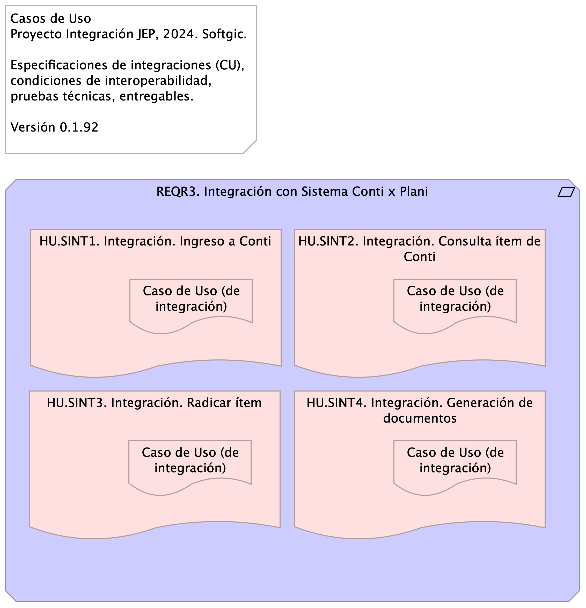

# Casos de Uso del Proyecto JEP

* [Introducción](#Introducción)
* [REQR3. Integración con Sistema Conti x Plani (Requirement)](#reqr3.-integración-con-sistema-conti-x-plani-requirement)
  * [HU.SINT1. Integración. Ingreso a Conti (Deliverable)](#hu.sint1.-integración.-ingreso-a-conti-deliverable)
    * [Caso de Uso (de integración) (Deliverable)](#caso-de-uso-de-integración-deliverable)
  * [HU.SINT2. Integración. Consulta ítem de Conti (Deliverable)](#hu.sint2.-integración.-consulta-ítem-de-conti-deliverable)
    * [Caso de Uso (de integración) (Deliverable) 2](#caso-de-uso-de-integración-deliverable-2)
  * [HU.SINT3. Integración. Radicar ítem (Deliverable)](#hu.sint3.-integración.-radicar-ítem-deliverable)
    * [Caso de Uso (de integración) (Deliverable) 3](#caso-de-uso-de-integración-deliverable-3)
  * [HU.SINT4. Integración. Generación de documentos (Deliverable)](#hu.sint4.-integración.-generación-de-documentos-deliverable)
    * [Caso de Uso (de integración) (Deliverable) 4](#caso-de-uso-de-integración-deliverable-4)

## Introducción

{height=500px}

---
title: Especificación de Integraciones (caso de uso)
subtitle: Implementación Proyecto Evolución de Interoperabilidad JEP, Softgic
subject: Implementación Proyecto JEP
author: ${DEVDOCS_AUTOR}
date: 2024-09-16
keywords: [Integración, Interoperabilidad, JEP, Softgic, Caso de uso]
header-left: include/jeplogo.jpg
lang: "en"
titlepage: true
titlepage-rule-color: "360049"
geometry:
  - top=1in
  - bottom=1in
fignos-cleveref: True
fignos-plus-name: Fig.
fignos-caption-name: Imagen
tablenos-caption-name: Tabla
...

Documentación de los casos de uso de integración del proyecto JEP relacionados con los requerimientos. COndiciones de interoperabilidad, pruebas técnicas y entregables.

Fuente: Acta de requerimientos Integración Plani - Proceso Precontractual_V4.pdf

## REQR3. Integración con Sistema Conti x Plani

Atendiendo la necesidad de la Subdirección de Contratación de implementar el flujo de gestión precontractual en el sistema de Gestión Documental - Conti se requiere contar con la información de los ítems del Plan Anual de Adquisiciones – PAA para iniciar el proceso, la cual se encuentra gestionada en el Sistema de Gestión y Planeación Institucional PLANi.

Los casos de uso asociados al requerimiento se listan más adelante.

### HU.SINT1. Integración. Ingreso a Conti

#### Caso de Uso (de integración)

Solicitar autenticación a la aplicación Conti y devolver resultado de la solicitud de ingreso a la aplicación Plani.

#### Elementos
Elegir y describir los elementos de la actual integración.

* [x] App consumidora (A)
* [x] Mensaje
* [ ] Canal
* [ ] Ruteo
* [ ] Traducción
* [x] App proveedora (B)
* [ ] Monitoreo

Aplicación consumidora A: Plani. Aplicación proveedora B: Conti

Mensaje solicitud: (ver estándar de nombramiento) Ingreso a Conti

* Tipo: TXT | SOAP | XML | JSN | YML | BASE64
* Contenido: Usuario o identidad Conti

Mensaje respuesta: Rpta. Ingreso a Conti

* Tipo: TXT | SOAP | XML | JSN | YML | BASE64
* Contenido: Estado de solicitud de ingreso a Conti

Mensaje excepción: Rpta. Ingreso a Conti

* Tipo: TXT | SOAP | XML | JSN | YML | BASE64
* Contenido: Código de respuesta: HTTP 500 | TXT | Numeración (entero)

#### Diseño
Message Construct | Message Routing | Message Transformation | Messaging Endpoints | Messaging Channels | …

La aplicación consumidora y proveedora compartirán capacidades mediante un mensaje de autenticación (Message Construct).

#### Matriz de interoperabilidad
Detalle del intercambio entre sistemas de información o aplicaciones. 

App Plani requiere compartir Información [I], Funcionalidad [F], Seguridad o Servicios [S] con la App Plani.

|                | Conti | Plani          | Legali | Otros |
|----------------|-------|----------------|--------|-------|
| Conti  (B)      | X     | Seguridad |        |       |
| Plani  (A)      |       | X              |        |       |
| Legali         |       |                | X      |       |
| Otros Sistemas |       |                |        | X     |

Table: Matriz de interoperabilidad del CU Ingreso a Conti.

#### Pruebas Realizables
Por cada caso de prueba de integración describir el resultado del intercambio entre sistemas de información o aplicaciones según la Matriz de interoperabilidad.

* PRUB1. Consumo: la aplicación consumidora Plani no recibe una respuesta a tiempo.
* PRUB2. Ingreso: la aplicación proveedora Conti no provee un ingreso autorizado.

### HU.SINT2. Integración. Consulta ítem de Conti

#### Caso de Uso (de integración)

Solicitar consulta de ítem a la aplicación Plani y obtener resultado de la consulta. La solicitud de consulta podrá realizarla con mínimo un parámetro, o la combinación de todos. Los parámetros son los siguientes:

1. Número de ítem
1. Fecha estimada de inicio de proceso de selección
1. Vigencia de ejecución
1. Fuente de los recursos
1. Modalidad de selección Interna (manual de contratación)

Esta integración permitirá que el sistema Conti consulte al sistema Plani la información de acuerdo con los campos solicitados. Cuando la aplicación Plani ejecute la consulta enviará, esta integración enviarea de regreso a Conti la lista de ítems relacionados que ya se encuentren en estado aprobado y que correspondan a la dependencia del usuario parametrizado en Conti.

#### Elementos
Elegir y describir los elementos de la actual integración.

* [x] App consumidora (A)
* [x] Mensaje
* [x] Canal
* [ ] Ruteo
* [x] Traducción
* [x] App proveedora (B)
* [ ] Monitoreo

Aplicación consumidora A: Conti. Aplicación proveedora B: Plani

Mensaje solicitud: (ver estándar de nombramiento) Consulta ítem

* Tipo: TXT | SOAP | XML | JSN | YML | BASE64
* Contenido: Estructura de datos consulta ítem

1. Número de ítem
1. Fecha estimada de inicio de proceso de selección
1. Vigencia de ejecución
1. Fuente de los recursos
1. Modalidad de selección Interna (manual de contratación)

Mensaje respuesta: Rpta. Ingreso a Conti

* Tipo: TXT | SOAP | XML | JSN | YML | BASE64
* Contenido: Estructura de datos ítem aprobado

1. Vigencia de ejecución
1. ítem PAA
1. Fuente de los recursos
1. Valor Total Estimado del Contrato 5. Código UNSPSC
1. Objeto
1. Fecha estimada de inicio de proceso de selección(mes
1. Fecha estimada de presentación de ofertas (mes)
1. Duración estimada del contrato
1. Duración estimada del contrato (intervalo: días, meses, años)
1. Modalidad de selección Interna
1. Modalidad SECOPII
1. Departamento
1. Municipio
1. Dependencia
1. Responsable
1. Ordenador del gasto
1. Correo electrónico responsable

Mensaje excepción: Rpta. Ingreso a Conti

* Tipo: TXT | SOAP | XML | JSN | YML | BASE64
* Contenido: Código de respuesta: ej. HTTP 500 | TXT | Numeración (entero)

#### Diseño
Message Construct | Message Routing | Message Transformation | Messaging Endpoints | Messaging Channels | …

La aplicación consumidora y proveedora compartirán capacidades mediante un canal centralizado, y mensajes de intercambio de información transformada de extremo a extremo. (Message Construct, Message Routing, Message Transformation, Messaging Endpoints).

#### Matriz de interoperabilidad
Detalle del intercambio entre sistemas de información o aplicaciones. 

App Plani requiere compartir Información [I], Funcionalidad [F], Seguridad o Servicios [S] con la App Plani.

|                | Conti (A) | Plani (B)         | Legali | Otros |
|----------------|-------|----------------|--------|-------|
| Conti  (A)     | X     | Información    |        |       |
| Plani  (B)     |       | X              |        |       |
| Legali         |       |                | X      |       |
| Otros Sistemas |       |                |        | X     |

Table: Matriz de interoperabilidad del CU Consulta ítem.

#### Pruebas Realizables
Por cada caso de prueba de integración describir el resultado del intercambio entre sistemas de información o aplicaciones según la Matriz de interoperabilidad.

* PRUB1.0 Consumo: la aplicación consumidora Conti no recibe la respuesta de la consulta  a tiempo.
* PRUB11. Consulta sin resultado: la aplicación proveedora Plani  entrega una respuesta vacía.
* PRUB12. Consulta incorrecta: la aplicación proveedora Plani no provee el  formato de respuesta esperado.

### HU.SINT3. Integración. Radicar ítem

#### Caso de Uso (de integración)

Valida la información en el aplicación Conti y otorga el acceso del mismo.

#### Elementos
Elegir y describir los elementos de la actual integración.

* [x] App consumidora (A)
* [x] Mensaje
* [ ] Canal
* [ ] Ruteo
* [ ] Traducción
* [x] App proveedora (B)
* [ ] Monitoreo

Aplicación consumidora A: Plani
Aplicación proveedora B: Conti
Mensaje: Ingreso a Conti
* Tipo: SOAP | XML | JSN | 
* Contenido: Usuario o identidad Conti

#### Diseño
Message Construct | Message Routing | Message Transformation | Messaging Endpoints | Messaging Channels | …

La aplicación consumidora y proveedora compartirán capacidades mediante el un mensaje de autenticación (Message Construct).

#### Matriz de interoperabilidad
Detalle del intercambio entre sistemas de información o aplicaciones. 

App Plani requiere compartir Información [I], Funcionalidad [F], Seguridad o Servicios [S] con la App Plani.

|                | Conti | Plani          | Legali | Otros |
|----------------|-------|----------------|--------|-------|
| Conti  (B)      | X     | Seguridad |        |       |
| Plani  (A)      |       | X              |        |       |
| Legali         |       |                | X      |       |
| Otros Sistemas |       |                |        | X     |

Table: Matriz de interoperabilidad del CU Ingreso a Conti.

#### Pruebas Realizables
Por cada caso de prueba de integración describir el resultado del intercambio entre sistemas de información o aplicaciones según la Matriz de interoperabilidad.

* PRUB1. Consumo: la aplicación consumidora Plani no recibe una respuesta a tiempo.
* PRUB2. Ingreso: la aplicación proveedora Conti no provee un ingreso correcto.

### HU.SINT4. Integración. Generación de documentos

#### Caso de Uso (de integración)

Valida la información en el aplicación Conti y otorga el acceso del mismo.

#### Elementos
Elegir y describir los elementos de la actual integración.

* [x] App consumidora (A)
* [x] Mensaje
* [ ] Canal
* [ ] Ruteo
* [ ] Traducción
* [x] App proveedora (B)
* [ ] Monitoreo

Aplicación consumidora A: Plani
Aplicación proveedora B: Conti
Mensaje: Ingreso a Conti
* Tipo: SOAP | XML | JSN | 
* Contenido: Usuario o identidad Conti

#### Diseño
Message Construct | Message Routing | Message Transformation | Messaging Endpoints | Messaging Channels | …

La aplicación consumidora y proveedora compartirán capacidades mediante el un mensaje de autenticación (Message Construct).

#### Matriz de interoperabilidad
Detalle del intercambio entre sistemas de información o aplicaciones. 

App Plani requiere compartir Información [I], Funcionalidad [F], Seguridad o Servicios [S] con la App Plani.

|                | Conti | Plani          | Legali | Otros |
|----------------|-------|----------------|--------|-------|
| Conti  (B)      | X     | Seguridad |        |       |
| Plani  (A)      |       | X              |        |       |
| Legali         |       |                | X      |       |
| Otros Sistemas |       |                |        | X     |

Table: Matriz de interoperabilidad del CU Ingreso a Conti.

#### Pruebas Realizables
Por cada caso de prueba de integración describir el resultado del intercambio entre sistemas de información o aplicaciones según la Matriz de interoperabilidad.

* PRUB1. Consumo: la aplicación consumidora Plani no recibe una respuesta a tiempo.
* PRUB2. Ingreso: la aplicación proveedora Conti no provee un ingreso correcto.

[^1]: Generated: Fri Nov 01 2024 16:11:15 GMT-0500 (COT)
